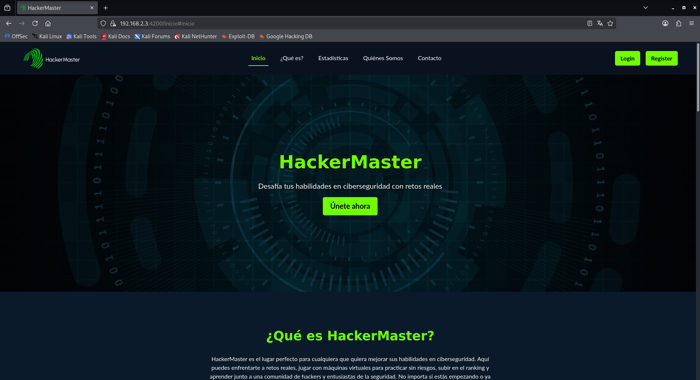
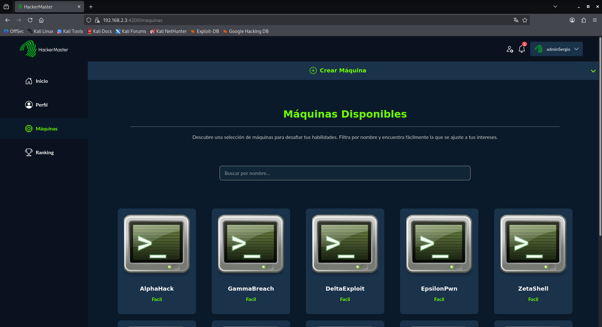
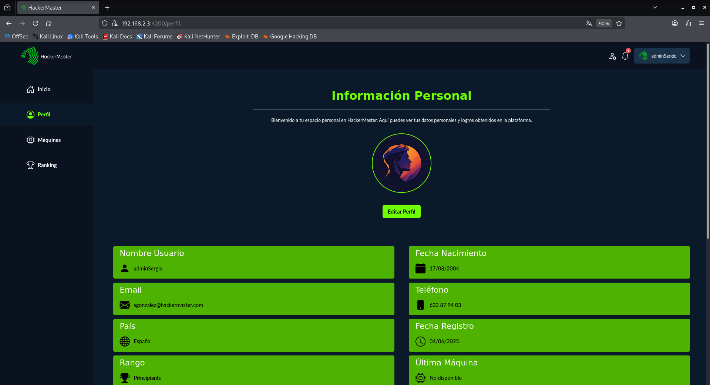
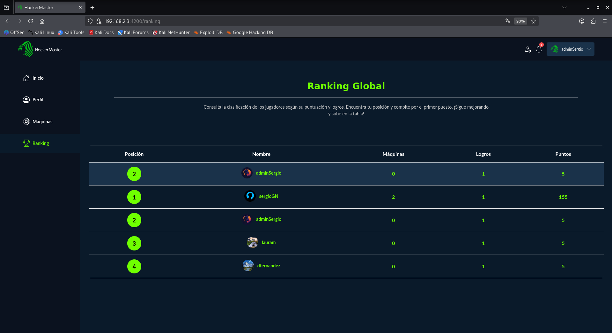
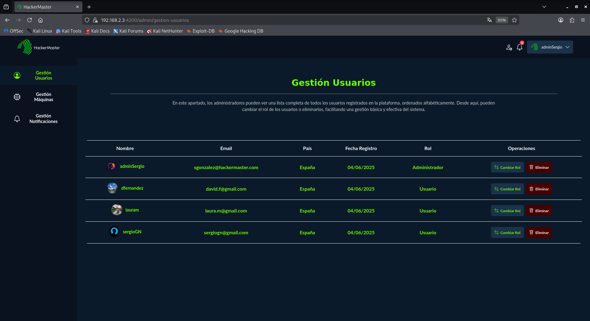

<h1 align="center">HackerMaster</h1>

<p align="center">
  
</p>

***Fecha:*** 25 de mayo de 2026
<br>***Autor***: Sergio González

---
## Índice

1. ***[Introducción](#1-introducción)***
2. ***[Objetivos del proyecto](#2-objetivos-del-proyecto)***
3. ***[Tecnologías utilizadas](#3-tecnologías-utilizadas)***
4. ***[Arquitectura del sistema](#4-arquitectura-del-sistema)***
5. ***[Estructura del proyecto](#5-estructura-del-proyecto)***
6. ***[Instalación y despliegue](#6-instalación-y-despliegue)***
7. ***[Uso de la plataforma](#7-uso-de-la-plataforma)***
8. ***[Funcionalidades principales](#8-funcionalidades-principales)***
9. ***[Usuarios de prueba](#9-usuarios-de-prueba)***
10. ***[Pruebas del sistema](#10-pruebas-del-sistema)***
11. ***[Seguridad del sistema](#11-seguridad-del-sistema)***
12. ***[Conclusiones](#12-conclusiones)***
13. ***[Trabajo futuro](#13-trabajo-futuro)***

---
## 1. ***Introducción***

HackerMaster es una plataforma web pensada para aprender y practicar ciberseguridad ofensiva de forma práctica. La idea principal del proyecto es poder trabajar con máquinas vulnerables en un entorno controlado, utilizando contenedores Docker para su despliegue.

La plataforma está enfocada al formato CTF (Capture The Flag), donde los usuarios tienen que resolver retos consiguiendo diferentes flags dentro de cada máquina. De esta forma, se intenta simular situaciones reales que se pueden encontrar en un entorno de pentesting.

Además de la parte de resolución de retos, la aplicación también permite que los propios usuarios suban sus máquinas, que después pueden ser revisadas y aprobadas por un administrador. Esto hace que la plataforma no sea solo un entorno de práctica, sino también un sistema colaborativo donde la comunidad puede aportar contenido.

Este proyecto se ha desarrollado como Trabajo de Fin de Grado, con la intención de unir el desarrollo de una aplicación web completa con conceptos de ciberseguridad, automatización de despliegues y administración de sistemas.

---
## 2. ***Objetivos del proyecto***

El objetivo principal de este proyecto es desarrollar una plataforma web funcional que permita aprender y practicar ciberseguridad ofensiva en un entorno controlado, utilizando máquinas vulnerables desplegadas mediante Docker.

A partir de este objetivo general, se han definido varios objetivos más concretos:

- Diseñar una aplicación web completa con sistema de usuarios, autenticación y gestión de perfiles.
- Permitir la creación, subida y ejecución de máquinas de entrenamiento en formato Docker.
- Implementar un sistema de retos tipo CTF basado en la obtención de flags.
- Desarrollar un sistema de ranking para fomentar la competición entre usuarios.
- Incluir un panel de administración para la revisión y gestión de las máquinas subidas por los usuarios.
- Automatizar el despliegue y control del tiempo de vida de las máquinas en ejecución.
- Aplicar medidas básicas de seguridad en la aplicación, como autenticación mediante JWT y validación de datos.

En conjunto, el proyecto busca simular un entorno lo más parecido posible a escenarios reales de pentesting, combinando aprendizaje, práctica y gestión de una plataforma web completa.

---
## 3. ***Tecnologías utilizadas***

Para el desarrollo de HackerMaster se han utilizado distintas tecnologías tanto en el frontend como en el backend, además de herramientas relacionadas con el despliegue y la base de datos.

En la parte del frontend se ha utilizado **Angular**, junto con **Bootstrap** para el diseño de la interfaz. Esto ha permitido crear una aplicación web dinámica, responsive y fácil de usar.

En el backend se ha trabajado con **Node.js** y **Express**, siguiendo una arquitectura de tipo MVC para organizar mejor el código y separar la lógica de la aplicación. Para la gestión de la base de datos se ha utilizado **MySQL**, junto con **Sequelize** como ORM para facilitar las consultas y evitar el uso directo de SQL.

También se ha hecho uso de **Docker**, que es una pieza clave del proyecto, ya que permite crear y ejecutar las máquinas de entrenamiento de forma aislada mediante contenedores.

Como parte de la seguridad y configuración del sistema se han utilizado tecnologías como **JWT** para la autenticación de usuarios, **bcrypt** para el cifrado de contraseñas, y herramientas como **dotenv** para la gestión de variables de entorno.

Por último, se han utilizado herramientas adicionales como **Morgan** para el registro de logs de la aplicación y **Docker Compose** para la orquestación del entorno completo.

---
## 4. ***Arquitectura del sistema***

La arquitectura de HackerMaster se basa en una separación clara entre frontend, backend y base de datos, siguiendo un modelo cliente-servidor típico de aplicaciones web modernas.

Por un lado, el **frontend** está desarrollado en Angular y es el encargado de toda la parte visual de la plataforma. Desde aquí el usuario interactúa con la aplicación, accede a las máquinas, gestiona su perfil y consulta su progreso. El frontend se comunica con el backend mediante peticiones HTTP a una API REST.

El **backend**, desarrollado con Node.js y Express, es el núcleo de la aplicación. Aquí se gestiona toda la lógica del sistema: autenticación de usuarios, gestión de máquinas, control de flags, ranking, notificaciones y administración. El backend expone una API REST que es consumida por el frontend.

La **base de datos MySQL** se utiliza para almacenar toda la información persistente del sistema, como usuarios, máquinas, puntuaciones, flags y notificaciones. El acceso a la base de datos se realiza a través de Sequelize, lo que facilita la gestión de consultas y modelos.

Una parte importante de la arquitectura es el uso de **Docker**, que permite el despliegue de máquinas de entrenamiento en contenedores aislados. Cada máquina se ejecuta de forma independiente, lo que garantiza un entorno seguro y controlado para los usuarios.

Además, se utiliza **Docker Compose** para coordinar el despliegue completo de la aplicación, incluyendo backend, frontend y base de datos, facilitando así la instalación y ejecución del proyecto en cualquier entorno.

En conjunto, la arquitectura permite separar responsabilidades, facilitar el mantenimiento del código y asegurar un entorno escalable y modular.

---
## 5. ***Estructura del proyecto***

El proyecto HackerMaster está organizado en una estructura modular que separa claramente el backend, el frontend y los recursos necesarios para el despliegue de la aplicación.

Dentro del directorio principal del proyecto se encuentra la carpeta `sources`, que contiene todo el código de la aplicación.

En primer lugar, el **backend** está desarrollado con Node.js y Express, y se organiza en varias carpetas según su funcionalidad:

- **config**: contiene la configuración de la base de datos y otros parámetros del sistema.
- **controllers**: gestiona la lógica principal de la aplicación.
- **models**: define los modelos de la base de datos utilizando Sequelize.
- **routes**: define las rutas de la API REST.
- **middlewares**: incluye funciones intermedias como autenticación o validaciones.
- **utils**: contiene funciones auxiliares utilizadas en diferentes partes del sistema.
- **logs**: almacena registros de actividad de la aplicación.
- **ssl**: contiene los certificados necesarios para habilitar HTTPS.
- **uploads**: almacena archivos subidos por los usuarios.
- **app.js**: punto de entrada principal del backend.

Por otro lado, el **frontend** está desarrollado en Angular y se encuentra dentro de la carpeta `frontend`. Su estructura principal es la siguiente:

- **components**: componentes reutilizables de la interfaz.
- **core**: servicios principales de la aplicación, como autenticación o comunicación con la API.
- **pages**: páginas principales de la plataforma.
- **interceptors**: interceptores HTTP para controlar peticiones y respuestas.
- **app.routes.ts**: definición de rutas del frontend.
- **app.config.ts**: configuración general de la aplicación.

Finalmente, en la raíz del proyecto se encuentran archivos importantes como el `despliegueAplicacion.yml`, utilizado para la configuración de Docker Compose, y scripts como `setup.sh`, que automatizan la instalación y despliegue del sistema.

---
## 6. ***Instalación y despliegue***

Para facilitar la instalación del proyecto, HackerMaster incluye un sistema de despliegue automatizado mediante Docker y un script de configuración inicial.

En primer lugar, es necesario clonar el repositorio del proyecto en la máquina local:

```bash
git clone https://github.com/dryke48/HackerMaster
cd HackerMaster
```

Una vez clonado el proyecto, se debe ejecutar el script de instalación incluido, el cual se encarga de instalar dependencias, construir los contenedores y levantar la aplicación completa:

```bash
chmod +x setup.sh
./setup.sh
```

Este script automatiza todo el proceso de despliegue utilizando ***Docker Compose***, por lo que no es necesario configurar manualmente ni la base de datos ni el backend.

Una vez finalizado el proceso, la plataforma queda disponible en la siguiente dirección:

```bash
https://192.168.2.3:4200
```

Es importante tener en cuenta que la aplicación utiliza ***certificados SSL autofirmados***, por lo que el navegador puede mostrar una advertencia de seguridad. En este caso, es necesario aceptar el certificado para poder acceder correctamente a la plataforma.

Además, el backend también utiliza HTTPS, por lo que la primera vez que se accede a la API es necesario aceptar el certificado desde el navegador antes de utilizar la aplicación.

---
## 7. ***Uso de la plataforma***

La plataforma HackerMaster está diseñada para ser intuitiva y fácil de usar, permitiendo que cualquier usuario pueda registrarse, acceder y comenzar a resolver máquinas en pocos pasos.

---
### 7.1 ***Registro e inicio de sesión***
---

El primer paso para utilizar la plataforma es el registro de un usuario. Una vez creado el usuario, se puede iniciar sesión utilizando las credenciales correspondientes.

Tras iniciar sesión, el usuario accede a su panel principal, donde puede ver su progreso, las máquinas disponibles y su información de perfil.

---
### 7.2 ***Gestión de máquinas***
---

Dentro del apartado de máquinas, los usuarios pueden visualizar todas las máquinas de entrenamiento disponibles en la plataforma. Cada máquina representa un reto de tipo CTF que debe ser resuelto.

Además, los usuarios también pueden subir sus propias máquinas en formato Docker. Estas máquinas pasan por un proceso de revisión por parte de los administradores antes de ser publicadas.

---
### 7.3 ***Resolución de retos (CTF)***
---

Cada máquina contiene dos flags: una flag de usuario y una flag de root. El objetivo es conseguir ambas flags mediante técnicas de pentesting dentro del entorno controlado.

Una vez obtenidas las flags, el usuario las introduce en la plataforma para validar la resolución de la máquina y obtener puntuación.

---
### 7.4 ***Sistema de ranking y progreso***
---

La plataforma incluye un sistema de ranking global donde los usuarios pueden ver su posición en función del número de máquinas resueltas y su puntuación.

Este sistema permite fomentar la competición entre usuarios y motivar el aprendizaje continuo dentro de la plataforma.

---
### 7.5 ***Capturas de pantalla***
---

A continuación se muestran algunas capturas de la plataforma en funcionamiento, que permiten ver de forma visual las principales pantallas del sistema.

---

#### Página principal


---

#### Catálogo de máquinas


---

#### Perfil de usuario


---

#### Ranking global


---

#### Panel de administración


---
## 8. ***Funcionalidades principales***

HackerMaster incluye un conjunto de funcionalidades diseñadas para ofrecer una experiencia completa de aprendizaje en ciberseguridad ofensiva, combinando gestión de usuarios, resolución de retos y administración de la plataforma.

---
### 8.1 ***Sistema de autenticación (JWT)***
---

La plataforma utiliza un sistema de autenticación basado en **JSON Web Tokens (JWT)**. Esto permite identificar a los usuarios de forma segura sin necesidad de mantener sesiones en el servidor.

Una vez que el usuario inicia sesión, se genera un token que se utiliza en cada petición para acceder a rutas protegidas.

---
### 8.2 ***Gestión de usuarios***
---

Cada usuario dispone de un perfil donde puede consultar su progreso, máquinas resueltas y puntuación total. Además, el sistema permite el registro y autenticación de nuevos usuarios de forma controlada.

---
### 8.3 ***Panel de administración***
---

La plataforma cuenta con un panel de administración desde el cual se pueden gestionar usuarios y revisar las máquinas subidas por los usuarios antes de su publicación.

Este sistema permite aprobar o rechazar máquinas, asegurando que el contenido publicado sea adecuado para el entorno de aprendizaje.

---
### 8.4 ***Sistema de notificaciones***
---

Los usuarios reciben notificaciones dentro de la plataforma sobre eventos relevantes, como la aprobación de una máquina o cambios en su estado.

Este sistema mejora la comunicación dentro de la aplicación sin necesidad de sistemas externos.

---
### 8.5 ***Despliegue automático de máquinas Docker***
---

Una de las funcionalidades más importantes del proyecto es el despliegue automático de máquinas mediante **Docker**.

Cada máquina se ejecuta en un contenedor aislado, lo que permite ofrecer entornos seguros y controlados para cada reto.

---
### 8.6 ***Control del tiempo de ejecución***
---

Las máquinas desplegadas tienen un tiempo de vida limitado. Pasado un determinado periodo (por ejemplo, 3 horas), el sistema detiene automáticamente el contenedor para evitar un uso excesivo de recursos.

Esto permite una gestión eficiente del servidor y asegura la disponibilidad de la plataforma para todos los usuarios.

---
## 9. ***Usuarios de prueba***

Con el objetivo de facilitar las pruebas de la plataforma, se han creado varios usuarios por defecto ya registrados en el sistema.

Estos usuarios permiten acceder directamente a la aplicación sin necesidad de realizar el proceso de registro, lo que facilita la evaluación del funcionamiento general del proyecto.

Los usuarios disponibles son los siguientes:

- `sgonzalez@hackermaster.com` / `12345678QA` (usuario administrador)
- `sergiogn@gmail.com` / `12345678QA`
- `laura.m@gmail.com` / `12345678QA`

El usuario administrador dispone de permisos adicionales que le permiten acceder al panel de gestión de la plataforma, donde puede administrar usuarios y revisar las máquinas subidas.

Es importante destacar que estos usuarios se han creado únicamente con fines de demostración y pruebas del sistema, y no deben utilizarse en un entorno de producción.

---
## 10. ***Pruebas del sistema***

Para asegurar el correcto funcionamiento de HackerMaster, se han realizado diferentes tipos de pruebas que validan tanto la lógica interna de la aplicación como su comportamiento bajo carga.

Estas pruebas se dividen en dos grandes bloques: pruebas unitarias e integración, y pruebas de sistema o carga.

---
### 10.1. ***Pruebas unitarias e integración***
---

La aplicación cuenta con pruebas automáticas implementadas en el backend, diseñadas para verificar el correcto funcionamiento de los distintos módulos del sistema.

Estas pruebas se encuentran dentro del directorio `sources/backend/tests/` y pueden ejecutarse mediante el siguiente comando:

```bash
cd sources/backend
npm test
```

Las pruebas permiten comprobar funcionalidades como la autenticación de usuarios, la gestión de máquinas y el correcto funcionamiento de las rutas de la API.

Los resultados se muestran directamente en consola, indicando si las pruebas han sido superadas o si se ha detectado algún error.

---
### 10.2. ***Pruebas de carga***
---

Además de las pruebas funcionales, se han realizado pruebas de carga para evaluar el rendimiento del sistema bajo múltiples solicitudes simultáneas.

Para ello se ha utilizado la herramienta ***Artillery***, que permite simular usuarios accediendo a la API de forma concurrente.

Antes de ejecutar las pruebas, es necesario asegurarse de que la plataforma esté desplegada:

```bash
docker-compose -f despliegueAplicacion.yml up
```

Posteriormente, se ejecuta la prueba desde el backend con el siguiente comando:

```bash
NODE_TLS_REJECT_UNAUTHORIZED='0' npx artillery run tests-artillery/sistema.test.yml
```

Los resultados obtenidos permiten analizar tiempos de respuesta, carga del servidor y posibles errores bajo condiciones de uso intensivo, ayudando a validar la estabilidad del sistema.

---
## 11. ***Seguridad del sistema***

En este apartado se analiza la seguridad general de la plataforma **HackerMaster**, tanto a nivel de aplicación como de infraestructura. Aunque la aplicación ya incorpora varias medidas de protección, es importante entender que la seguridad no depende de una única tecnología, sino de una combinación de buenas prácticas en diferentes capas del sistema.

---
### ***Seguridad a nivel de aplicación***
---

La aplicación cuenta con varias medidas orientadas a proteger tanto a los usuarios como a la propia API:

- **Autenticación mediante JWT**: se utiliza JSON Web Tokens para gestionar el acceso a las rutas protegidas, evitando depender de sesiones tradicionales en servidor.
- **Hash de contraseñas con bcrypt**: las contraseñas no se almacenan en texto plano, sino que se cifran antes de guardarse en la base de datos.
- **Sequelize como ORM**: ayuda a reducir el riesgo de **inyección SQL**, ya que las consultas se gestionan de forma parametrizada.
- **Validación de entradas**: se controlan los datos que introduce el usuario para evitar comportamientos inesperados o ataques básicos.
- **Rate limiting**: se limita el número de peticiones por usuario o IP para dificultar ataques de fuerza bruta o abuso de la API.

---
### ***Seguridad en cabeceras HTTP***
---

A nivel de peticiones HTTP también se han aplicado medidas importantes:

- **Helmet**: se utiliza para configurar cabeceras de seguridad que ayudan a mitigar ataques como XSS, clickjacking o sniffing de contenido.
- **CORS configurado**: se restringen los dominios que pueden hacer peticiones a la API, evitando accesos no autorizados desde otros orígenes.

---
### ***Seguridad en la comunicación***
---

La plataforma está preparada para trabajar con **HTTPS**, lo que garantiza que la información viaja cifrada entre el cliente y el servidor.

Esto es especialmente importante en una plataforma como esta, donde se manejan credenciales, tokens y datos sensibles de usuarios.

---
### ***Seguridad del servidor e infraestructura***
---

A nivel de despliegue también se han tenido en cuenta varias buenas prácticas:

- Uso de **Docker Compose** para aislar servicios.
- Separación entre frontend y backend.
- Configuración mediante variables de entorno con **dotenv**, evitando exponer credenciales en el código.
- Uso de certificados SSL (aunque sean autofirmados en entorno de desarrollo).

---
### ***Riesgos que todavía podrían existir***
---

Aunque el sistema está bastante protegido, siempre hay puntos que se podrían mejorar:

- Implementar protección CSRF en ciertas acciones críticas si se ampliara el uso de cookies.
- Añadir doble factor de autenticación para usuarios administradores.
- Mejorar el control de permisos (roles más granulares).
- Monitorización avanzada de logs para detectar comportamientos sospechosos.

---
## 12. ***Conclusiones***

Una vez terminado el desarrollo y las pruebas de la plataforma **HackerMaster**, se puede decir que el proyecto cumple bastante bien con el objetivo principal: ofrecer un entorno de aprendizaje para practicar pentesting de forma controlada.

Durante el desarrollo he intentado que la aplicación no se quedara solo en lo funcional, sino que también reflejara situaciones reales que se pueden encontrar en entornos de producción, tanto a nivel de arquitectura como de seguridad.

---

En la parte funcional, la plataforma permite:

- Subir y gestionar máquinas de entrenamiento en formato Docker.
- Resolver retos estilo CTF con flags de usuario y root.
- Hacer seguimiento del progreso de los usuarios.
- Disponer de un panel de administración para controlar el contenido.

Todo esto hace que la experiencia sea bastante completa y cercana a un entorno real de ciberseguridad.

---

En la parte de seguridad, se han aplicado varias medidas importantes desde el inicio del proyecto:

- Autenticación mediante JWT.
- Cifrado de contraseñas con bcrypt.
- Uso de ORM (Sequelize) para evitar inyecciones SQL.
- Protección mediante Helmet, CORS y rate limiting.
- Uso de HTTPS para cifrar la comunicación.

Aun así, también se ha visto que la seguridad nunca es algo “cerrado”, ya que siempre hay mejoras posibles, especialmente en aspectos como control de roles, monitorización o autenticación avanzada.

---

En general, el proyecto ha servido para entender mejor cómo se diseña una aplicación web completa, no solo desde el punto de vista del desarrollo, sino también desde la perspectiva de la seguridad, que es una parte fundamental en cualquier sistema real.

Más que un producto final cerrado, HackerMaster se puede ver como una base sobre la que seguir construyendo y mejorando.

---
## 13. ***Trabajo futuro***

Aunque la plataforma **HackerMaster** ya cuenta con una base funcional bastante completa, todavía hay varias mejoras que se podrían aplicar para hacerla más realista, escalable y cercana a un entorno profesional de ciberseguridad.

---
### ***Mejoras en seguridad***
---

Uno de los primeros puntos de mejora sería reforzar aún más la seguridad del sistema:

- Implementar **autenticación en dos factores (2FA)** para usuarios y administradores.
- Añadir un sistema de **roles más granular** (usuario, moderador, administrador).
- Mejorar la protección de endpoints sensibles con políticas más estrictas.
- Incorporar detección de actividad sospechosa mediante análisis de logs.

---
### ***Escalabilidad y rendimiento***
---

Para poder soportar un mayor número de usuarios y máquinas, sería necesario mejorar la arquitectura:

- Separar servicios en microservicios independientes.
- Optimizar el despliegue y gestión de máquinas Docker.
- Implementar colas de tareas para gestionar cargas elevadas.
- Mejorar el sistema de caché para consultas frecuentes.

---
### ***Infraestructura (VPN y red de máquinas)***
---

Una de las mejoras más importantes sería la incorporación de una **VPN para el acceso a las máquinas de entrenamiento**.

Actualmente, el acceso a las máquinas se realiza de forma directa dentro del entorno de la aplicación, pero en un entorno más realista lo ideal sería aislar completamente las máquinas en una red interna.

Con una VPN se conseguiría:

- Acceso seguro a las máquinas desplegadas.
- Aislamiento del entorno de prácticas respecto a la red principal.
- Simulación más realista de entornos de pentesting profesionales.
- Mayor control sobre el tráfico entre usuario y máquinas.

Este enfoque permitiría que cada usuario trabaje dentro de una red privada controlada, similar a lo que ocurre en entornos reales de auditoría.

---
### ***Nuevas funcionalidades***
---

También se podrían añadir nuevas características para mejorar la experiencia del usuario:

- Retos automáticos diarios o semanales.
- Ranking avanzado con estadísticas detalladas.
- Sistema de chat o foro interno para la comunidad.
- Sistema de logros más completo y visual.

---
### ***Mejoras en la experiencia de usuario***
---

- Dashboard personalizado para cada usuario.
- Interfaz más moderna e interactiva.
- Notificaciones en tiempo real.
- Mejor feedback al resolver máquinas.

---
### ***Conclusión del trabajo futuro***
---

En general, **HackerMaster** tiene una base sólida, pero todavía tiene bastante potencial de crecimiento. La idea es que pueda evolucionar hacia una plataforma más completa, segura y escalable, parecida a entornos reales de formación en ciberseguridad.
